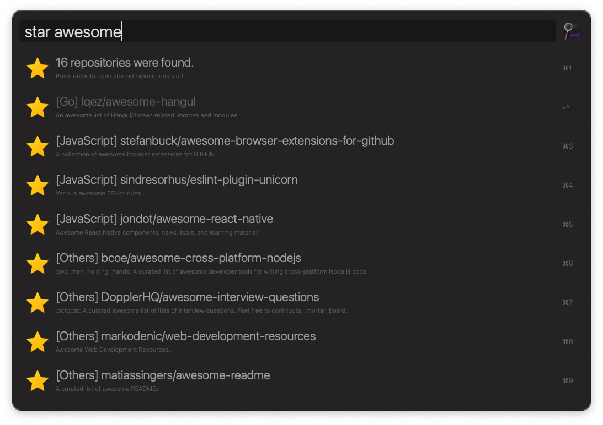
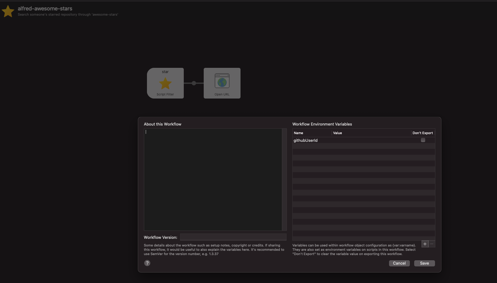

# alfred-awesome-stars

[](http://badge.fury.io/js/alfred-awesome-stars)
[](https://www.npmjs.com/package/alfred-awesome-stars)
[](https://github.com/jopemachine/alfred-awesome-stars/blob/master/LICENSE)
[](http://makeapullrequest.com)
[](https://GitHub.com/jopemachine/alfred-awesome-stars/issues/)


> Search starred repository through 'awesome-stars'



## Install

```
$ npm install --global alfred-awesome-stars
```

*Requires [Node.js](https://nodejs.org) 12+ and the Alfred [Powerpack](https://www.alfredapp.com/powerpack/).*

## Setup

### githubUserId

Enter github user id.

Make sure the user has [awesome-stars](https://github.com/maguowei/awesome-stars) repository containing readme.md



## Usage

In Alfred, type `star`, <kbd>Enter</kbd>, and your query.

`star` searchs starred repositories's `maintainer name`, `repository name`, `repository description`, `programming language`.

## Related

- [starred](https://github.com/maguowei/starred)
- [awesome-stars](https://github.com/maguowei/awesome-stars)

## Icon sources

This lib uses below icon sources

<a target="_blank" href="https://icons8.com">Image</a> icon by <a target="_blank" href="https://icons8.com">Icons8</a>

## License

MIT © [jopemachine](https://github.com/jopemachine/alfred-awesome-stars)
